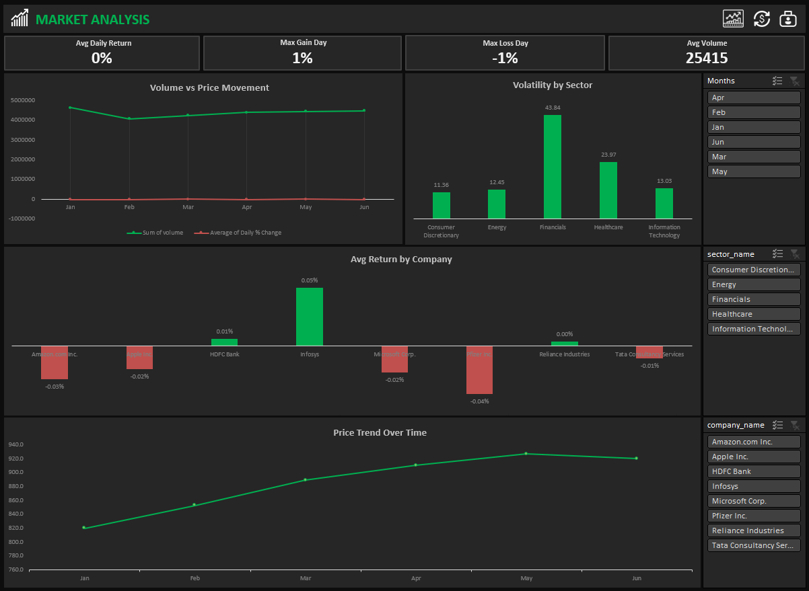
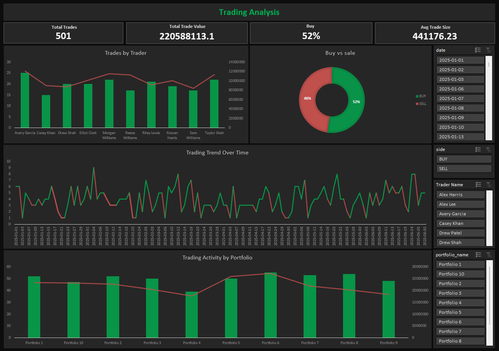
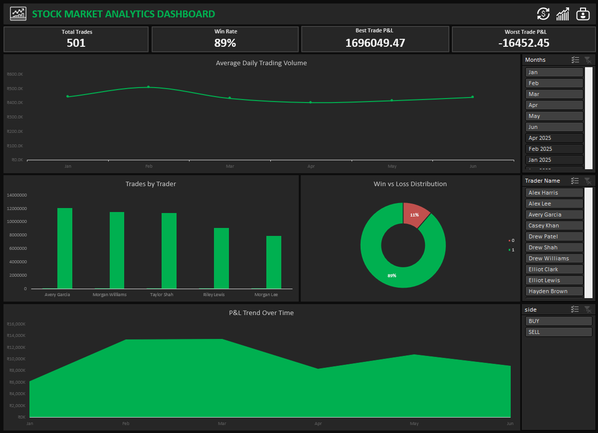

# 📊 Stock Market Analytics Dashboard
**Advanced Excel Project | Multi-Page Analytical Suite**

## 📌 Overview
An **end-to-end Stock Market Analytics & Trading Performance Dashboard** built in **Microsoft Excel** to analyze market trends, trading activity, and portfolio P&L using structured fact and dimension tables.
The project delivers a single executive dashboard with interactive KPIs and slicers for decision-making.

---

## ⭐ STAR Method Breakdown

### **S — Situation** 
The internship required analyzing a complex stock market dataset containing exchanges, companies, trades, portfolios, and realized P&L spread across multiple Excel sheets, without any predefined reporting structure.

### **T — Task**
Design a professional, management-ready dashboard that:
- Tracks market performance
- Monitors trading activity
- Evaluates portfolio profitability & P&L
- Enables **interactive analysis** for different portfolios, traders, companies, and dates 

### **A — Action**
- Modeled the dataset using fact and dimension tables (trades, prices, portfolios, traders, calendar)
- Created calculated fields for:
  - Daily returns, trade value, net profit, win rate, and return %
- Built Market Analysis, Trading Activity, and Portfolio P&L modules using:
  - Pivot Tables
  - Advanced Excel formulas (VLOOKUP, IFERROR, AVERAGE, SUM, COUNTIF)
- Designed a final executive dashboard with:
  - KPI cards
  - Trend, comparison, and distribution charts
  - Slicers for dynamic filtering across all visuals

### **R — Result**
- Delivered a **single-page executive dashboard** summarizing:
  - Market trends and volatility
  - Buy vs Sell behavior and trading intensity
  - Portfolio-wise and trader-wise profitability
- Enabled faster insights into top-performing portfolios, winning traders, and risk exposure
- Produced an internship-ready, interview-ready Excel analytics solution

---

## 📌 Key Features
- KPI cards, line charts, bar/column charts, donut charts, and slicers for dynamic filtering by date, trader, portfolio, and company.
- Structured tables, pivot tables, VLOOKUPs, calculated fields, and conditional formatting for clear visual insights.
- Identifies top-performing traders and portfolios, highlights market trends, and supports data-driven decision making. 

---

## 📊 Dashboards

### 1️⃣ Market Analysis Dashboard
Monitor market trends, volatility, and daily returns for data-driven insights.
 

### 2️⃣ Trading Activity Dashboard
Analyze trader and portfolio activity to track buy/sell behavior and trading efficiency.

### 3️⃣ Portfolio Performance & P&L Dashboard
Evaluate portfolio profitability, realized P&L, and win rates for performance assessment.
 

### 4️⃣ Final Executive Dashboard
Combine market, trading, and portfolio insights into a single interactive executive view.
 

---

## 🧮 Key KPIs
- Avg Daily Return %
- Max Gain & Loss Day
- Total Trades & Trade Value
- Buy vs Sell Ratio
- Total Realized P&L
- Win Rate & Avg Return %
- Best & Worst Trade

---

## 🎨 Features
- Interactive slicers (Date, Portfolio, Trader, Company)
- Automated KPI updates
- Clean executive layout
- Business-driven chart selection

---

## 📊 Tech Stack
- Microsoft Excel 
- Pivot Tables & Pivot Charts
- Excel Tables

---

## 🏁 Conclusion
This project demonstrates end-to-end stock market data analysis in Excel, combining market trends, trading behavior, and portfolio performance into a single executive-ready dashboard.
It provides clear, actionable insights for management, enabling quick evaluation of trading strategies, portfolio profitability, and market dynamics.

---

## 👤 Author
**Shadan Tech**   
_Data Analyst_

🔗 [LinkedIn Profile](http://www.linkedin.com/in/shadantech)  
🔗 [Tableau Public Profile](https://public.tableau.com/app/profile/shadan.sarfaraz/vizzes)
🔗 [Newsletter](https://shadantech.substack.com/)

---

## ⭐ Show Your Support
If you found this project insightful, give it a **⭐ Star** on GitHub — it helps others discover it too!  
Connect on **LinkedIn** for more Power BI, Tableau, and Data Analytics projects.